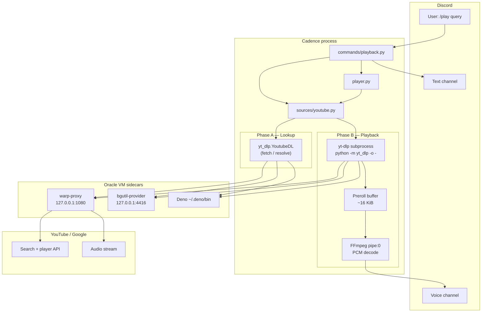
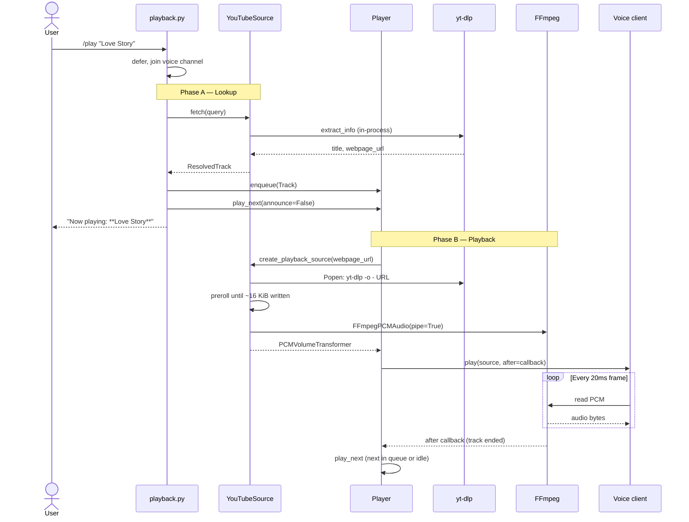
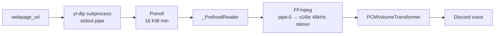
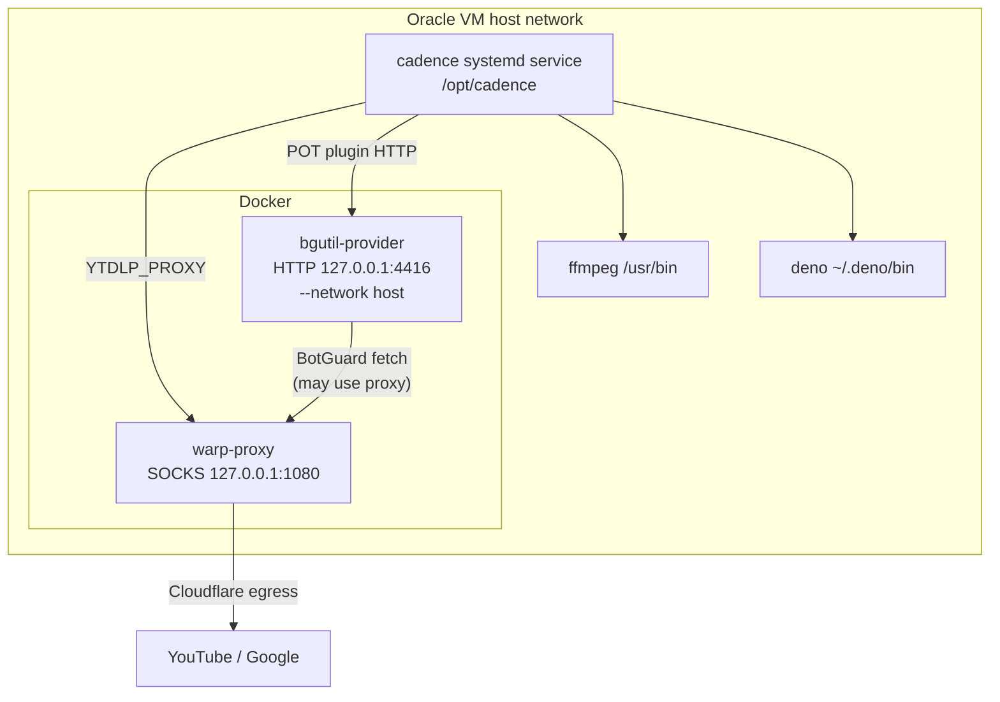
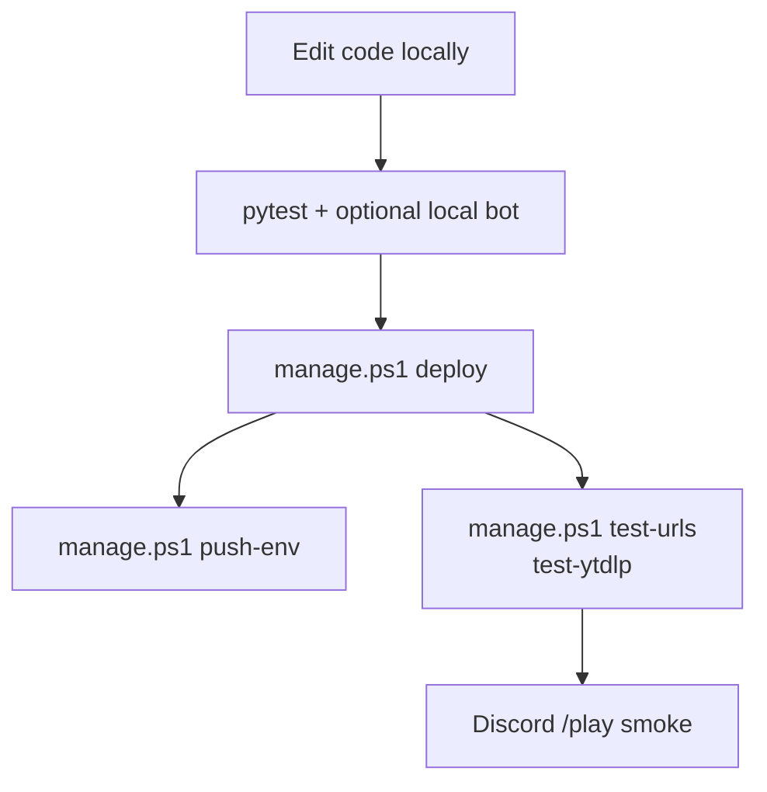

# YouTube playback architecture

How `/play` turns a search query into audio in a Discord voice channel. Related: [Oracle deploy](oracle-setup.md).

**Stack:** Python 3.11 · discord.py 2.x · yt-dlp · FFmpeg · WARP SOCKS · POT provider

---

## 1. Summary

Cadence uses a **two-phase** YouTube pipeline:

| Phase | Purpose | Mechanism |
|-------|---------|-----------|
| **A — Lookup** | Find the song (title, canonical URL) | In-process `yt_dlp.YoutubeDL` via `YouTubeSource.fetch()` |
| **B — Playback** | Stream audio to Discord | **Piped** `yt-dlp -o -` → FFmpeg → PCM voice |

The queue stores **`webpage_url`** only (e.g. `https://youtube.com/watch?v=…`), never
a `googlevideo.com` CDN URL. CDN URLs expire quickly and are bound to the IP that
requested them.

**Critical design rule:** playback must use the **same network path** as extraction
(WARP proxy, impersonate, cookies, EJS). Piping through yt-dlp achieves this; handing
FFmpeg a signed CDN URL directly does **not** (Oracle VM IP ≠ WARP IP → HTTP 403).

---

## 2. High-level architecture



---

## 3. `/play` sequence diagram



---

## 4. Phase A — Lookup (`YouTubeSource.fetch`)

**Entry:** `cadence/commands/playback.py` → `deps.source.fetch(query, is_url=…)`

**Implementation:** `cadence/sources/youtube.py`

| Input | yt-dlp target |
|-------|----------------|
| Search text (`Love Story`) | `ytsearch1:Love Story` |
| URL (`https://youtube.com/watch?v=…`) | URL as-is |

**Options** (via `build_ytdl_opts()` / `YtDlpConfig`):

| Option | Value | Why |
|--------|-------|-----|
| `format` | `bestaudio/best` | Audio-only |
| `remote_components` | `ejs:github` | YouTube signature/`n` solving (yt-dlp 2026+) |
| `proxy` | `YTDLP_PROXY` | WARP on VM |
| `impersonate` | `YTDLP_IMPERSONATE` (default `chrome`) | Browser TLS fingerprint |
| `extractor_args.youtube.player_client` | `tv`, `web_embedded`, `web` | Client rotation |
| `cookiefile` | `YTDLP_COOKIE_FILE` (optional) | Logged-in session |

**Bot-check fallback:** if impersonate fails with “sign in / not a bot”, retry once
without impersonate (`_extract_with_fallback`).

**Output:** `ResolvedTrack` → stored as `Track` (title + `webpage_url` + requester).
The `stream_url` from this pass is **not** used for Discord playback.

**Runs in:** `loop.run_in_executor` (never blocks the Discord event loop).

---

## 5. Phase B — Piped playback (`create_playback_source`)

**Entry:** `cadence/player.py` → `play_next()` → `source.create_playback_source(webpage_url, volume)`

**Why a subprocess for playback?** The in-process `YoutubeDL` instance is used for
fast metadata extraction. Playback spawns `python -m yt_dlp -o -` so stdout is a
continuous audio mux stream fed directly into FFmpeg — same flags as extraction,
no CDN URL handoff.

### 5.1 Pipeline



### 5.2 Steps (code path)

1. **`_ytdlp_playback_command()`** — builds CLI argv mirroring extraction config.
2. **`subprocess.Popen`** — `stdout=PIPE`, `stderr=PIPE`, `bufsize=0` (unbuffered).
3. **`_read_first_playback_chunk()`** — block until ≥ 16 KiB of muxed audio (or timeout).
   Prevents Discord from reading silence while yt-dlp still extracts.
4. **`_PrefixedReader`** — prepends preroll bytes, then streams rest of stdout.
5. **`FFmpegPCMAudio(pipe=True)`** — low-latency probe flags (no HTTP reconnect).
6. **`_ManagedPipeSource`** — kills yt-dlp when FFmpeg cleans up.
7. **`PCMVolumeTransformer`** — guild volume (0–100).

### 5.3 FFmpeg options

| Set | `before_options` | Used when |
|-----|------------------|-----------|
| `FFMPEG_OPTS` | `-reconnect 1 …` | Direct URL input (tests / legacy helper) |
| `FFMPEG_PIPE_OPTS` | `-nostdin -analyzeduration 0 -probesize 32 -fflags +nobuffer+flush_packets` | Piped yt-dlp stdout |

HTTP reconnect flags **must not** be used on pipe input — they break FFmpeg and
were removed after the pipe migration.

---

## 6. Oracle VM infrastructure



| Component | Port | Role |
|-----------|------|------|
| `warp-proxy` | `127.0.0.1:1080` | SOCKS proxy; masks Oracle datacenter IP |
| `bgutil-provider` | `127.0.0.1:4416` | PO token server (Deno in Docker) |
| Deno (host) | `~/.deno/bin` | yt-dlp EJS challenge scripts |
| FFmpeg (host) | `/usr/bin` | Decode piped audio → PCM |

**Bootstrap:** `tools/oracle/bootstrap.sh` installs all of the above.

**POT + Docker note:** the POT container uses `--network host` so it can reach
`127.0.0.1:1080` when yt-dlp forwards a proxy for BotGuard challenges. Without
host networking, the container's `127.0.0.1` is isolated from the host's WARP port.

---

## 7. Configuration

### 7.1 Environment variables

| Variable | Where | Purpose |
|----------|-------|---------|
| `YTDLP_PROXY` | VM `.env` | e.g. `socks5h://127.0.0.1:1080` |
| `YTDLP_IMPERSONATE` | VM `.env` | `chrome` (default) or empty to disable |
| `YTDLP_COOKIE_FILE` | VM (optional) | Path to exported YouTube cookies |
| `DISCORD_TOKEN` | VM `.env` | Bot token |
| `ORACLE_*` | Local `.env` only | SSH deploy toolkit |

`manage.ps1 push-env` writes runtime vars to `/opt/cadence/.env` on the VM.

### 7.2 Code wiring

```
Settings.load()  →  app.py  →  YtDlpConfig  →  YouTubeSource  →  Player
```

Files:

| File | Responsibility |
|------|----------------|
| `cadence/config.py` | `Settings.ytdlp_*` from env |
| `cadence/app.py` | Composition root |
| `cadence/sources/youtube.py` | Extraction + piped playback |
| `cadence/player.py` | Queue, `play_next`, voice controls |
| `cadence/interfaces.py` | `AudioSource` protocol (`fetch`, `resolve`, `create_playback_source`) |

---

## 8. Operator workflow



### 8.1 Common commands

```powershell
# Full deploy (uploads cadence/ when no git on VM, pip install, restart)
.\tools\oracle\manage.ps1 deploy

# Push .env only
.\tools\oracle\manage.ps1 push-env

# Phase A smoke (4 URLs, extraction only)
.\tools\oracle\manage.ps1 test-urls

# Phase A + POT/WARP health
.\tools\oracle\manage.ps1 test-ytdlp

# Infra status
.\tools\oracle\manage.ps1 warp-status
.\tools\oracle\manage.ps1 pot-status

# Bot logs (playback errors, FFmpeg)
.\tools\oracle\manage.ps1 logs -Lines 80
```

### 8.2 What each test validates

| Test | Validates | Does **not** validate |
|------|-----------|------------------------|
| `test-urls` | Phase A: metadata + `stream_url` extraction | Discord voice, FFmpeg pipe |
| `test-ytdlp` | WARP, POT, Rick + Love Story extraction | Discord voice |
| `/play` in Discord | Full Phase A + B + voice | — |

---

## 9. Failure modes & symptoms

| Symptom | Likely cause | Fix |
|---------|--------------|-----|
| `Couldn't find anything for that` | Phase A failed (bot check, no EJS, WARP down) | `warp-status`, `pot-status`, `test-urls` |
| `Now playing` then immediate silence / empty queue | Old bug: FFmpeg hit CDN URL without proxy (403) | Ensure piped playback is deployed (`create_playback_source`) |
| First 1–2 seconds missing | yt-dlp cold start before pipe had data | Preroll buffer (§5.2 step 3) |
| `ffmpeg was not found` | FFmpeg not on PATH | `bootstrap.sh` / `apt install ffmpeg`; `cadence.service` PATH |
| `Sign in to confirm you're not a bot` | Datacenter IP or missing POT/WARP | Restart sidecars; optional cookies |
| `Timed out waiting for playback stream` | yt-dlp subprocess failed silently | Check `journalctl -u cadence`; restart WARP/POT |

### 9.1 Log patterns

**Good (piped playback):** no `googlevideo.com` URLs in FFmpeg errors.

**Bad (pre-pipe architecture):**

```
HTTP error 403 Forbidden
Error opening input file https://rr5---sn-....googlevideo.com/videoplayback?...
```

---

## 10. Change log (2026-07)

| Change | Problem solved |
|--------|----------------|
| `remote_components: ejs:github` | Signature solving failed on yt-dlp 2026+ |
| WARP SOCKS + `YTDLP_PROXY` | Datacenter IP bot checks on Oracle |
| POT provider + host networking | PO token generation; Docker localhost proxy reachability |
| **Piped playback** (`create_playback_source`) | FFmpeg 403 on CDN URLs (IP mismatch with WARP) |
| **Preroll buffer** + low-latency FFmpeg flags | First seconds of each song dropped |
| `manage.ps1 deploy` uploads `cadence/` | VM without git never received code updates |
| `test-urls` sources `.env` + Deno PATH | False negatives in smoke tests |

---

## 11. Module map (quick reference)

```
cadence/
├── app.py                 # Wires Settings → YouTubeSource → Player
├── config.py              # YTDLP_PROXY, YTDLP_IMPERSONATE, YTDLP_COOKIE_FILE
├── commands/playback.py   # /play → fetch → enqueue → play_next
├── player.py              # play_next → create_playback_source → vc.play
├── interfaces.py          # AudioSource protocol
└── sources/youtube.py     # YtDlpConfig, build_ytdl_opts, make_playback_source

tools/oracle/
├── bootstrap.sh           # FFmpeg, Deno, Docker, WARP, POT
├── manage.ps1             # deploy, test-urls, test-ytdlp, push-env
├── healthcheck.sh         # Sidecar + plugin checks
├── test_urls_vm.py        # Phase A URL matrix
└── test_ytdlp_vm.py       # WARP + POT + acceptance probes
```

---

## 12. Related docs

- `overview.md §5.2` — playback engine behaviour (queue, loop, after-callback)
- `oracle-setup.md` — VM provisioning and operator runbook
- `commands.md` — slash command UX
- `remember.md §6` — gotchas (G-006 updated for webpage URL storage)
